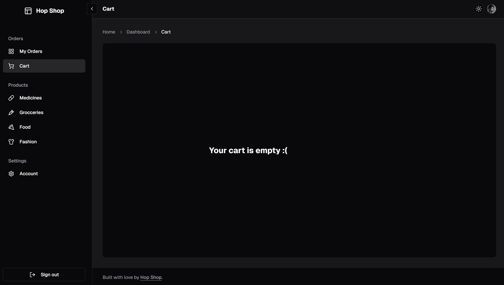

# HopShop

**HopShop** is an e-commerce website that sells medicines, groceries, home accessories, and even clothes. It provides a seamless shopping experience with features for displaying items, purchasing, and managing orders through a comprehensive dashboard. Built using React and Next.js for the frontend and Next.js, Supabase, and Clerk for the backend, it integrates modern UI components and libraries like Shadcn to enhance user experience.

### Tech Stack

- **Frontend**: React, Next.js
- **Backend**: Next.js, Supabase, Clerk
- **Libraries**: Shadcn

### Features

- **Item Display**: Browse and search for a wide range of products.
- **Purchasing**: Add items to the cart and complete purchases.
- **Dashboard**: Manage orders, inventory, and customer details.
- **Authentication**: Secure user authentication and account management.
- **Email Notifications**: Send emails for purchase confirmations and updates.
- **Shopping Cart**: Manage items in your cart and view previous purchases.

  

### Links

- [Live Demo](hopshop.vercel.app)
